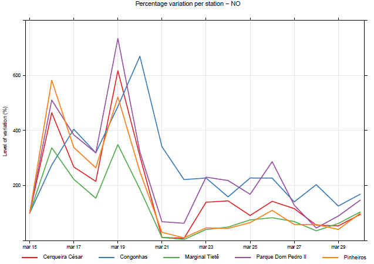
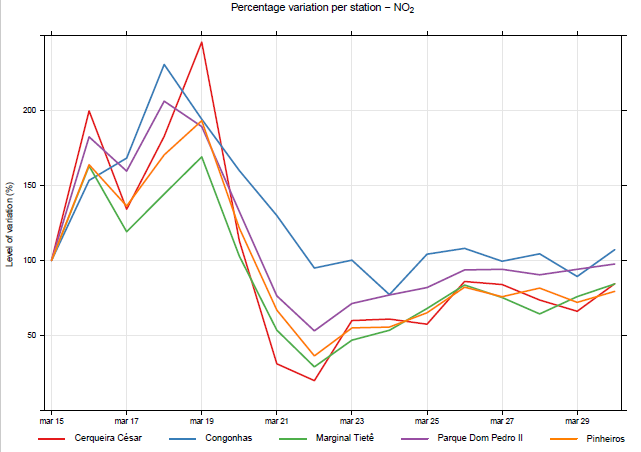

```{r setup, include=FALSE}
library(flexdashboard)
library(shiny)

```

# APRESENTACAO DA AREA DE ESTUDO E METODOS


## Column{data-width=600}

### AREA DE ESTUDO

```{r include = F}
library(tidyverse)
library(leaflet)
library(geobr)
library(readr)
library(DT)
library(kableExtra)
library(plotly)

df <- data.frame(cidade = c("Congonhas","Parque Dom Pedro II",
                            "Cerqueria Cesar","Marginal Tiete","Pinheiros"),
                 lng = c(-46.66304,-46.62767,-46.67231,-46.7434, -46.70165),
                 lat = c(-23.61591,-23.54485, -23.55315, -23.51871, -23.56107))

stat <- read_municipality(code_muni = 3550308, year = 2018, simplified = T)
df$cor <- c("green", "blue","red","orange","purple")

pal <- colorFactor(df$cor, levels = df$cidade)

map_lealet <- leaflet(df, 
                      options = leafletOptions(zoomControl = T, attributionControl = FALSE)) %>% 
  addTiles() %>% 
  addProviderTiles(providers$OpenStreetMap.HOT) %>% 
  addMiniMap(zoomLevelFixed = 5, collapsedHeight = 15, 
             tiles = providers$OpenStreetMap) %>% 

  fitBounds(-47.158392,-24.048874,-46.169622,-23.345940) %>%
  

  addCircleMarkers(df$lng[1], 
             df$lat[1], 
             label = "Congonhas", 
             opacity = 1,
             stroke = F,
             fillOpacity = 1,
             color = "green") %>%
  
  
  addCircleMarkers(df$lng[2], 
             df$lat[2], 
             label = "Parque Dom Pedro II", 
             opacity = 1,
             stroke = F,
             fillOpacity = 1,
             col = "blue") %>%
  
  
  addCircleMarkers(df$lng[3], 
             df$lat[3], 
             label = "Cerqueira Cesar", 
             opacity = 1,
             stroke = F,
             fillOpacity = 1,
             col = "red") %>%
  
  
  addCircleMarkers(df$lng[4], 
             df$lat[4], 
             label = "Marginal Tiete",
             opacity = 1,
             stroke = F, 
             fillOpacity = 1,
             col = "orange") %>%
  
  
  addCircleMarkers(df$lng[5], 
             df$lat[5],
             radius = 10,
             label = "Pinheiros",
             opacity = 1,
             stroke = F,
             fillOpacity = 1,
             col = "purple") %>%
  
  
  addPolygons(data = stat$geom, fillOpacity = 0, color = "black",
              opacity = 1, weight = 2.5, layerId = "São Paulo") %>%
  
  
  addLegend(colors = df$cor, labels = df$cidade, 
            opacity = 1, title = "STATIONS:") %>% 
  
  addLegend(colors = "black", labels = "São Paulo", 
            opacity = 1, labFormat = "bin") %>% 
  
  addScaleBar(position = "topleft") %>% 
  addMeasure(primaryLengthUnit = "meters", primaryAreaUnit = "sqmeters",position = "bottomleft")

```

```{r echo = FALSE}
map_lealet
```

## Column{data-width=400}

### ESTACOES

```{r include=FALSE}
library(kableExtra); library(data.table)

dados <- read.delim2("Tabelas_stations.csv",
                   sep = ",",
                   header = T,encoding = "latin1")

dados <- dados[-6,]
colnames(dados) <-
  c("Nome","Longitude","Latitude","Cod.","n","%")

stations <- dados %>%
  kable(align = "c", booktabs = T) %>% 
  kable_styling(bootstrap_options = "striped", 
                                   position = "center", 
                                  full_width = T, font_size = 12)

oi <- dados %>% DT::datatable(rownames = F)
```

```{r echo = F}
stations
```

### METODOS

Nesse estudo, as analises estatisticas realizadas foram as seguintes:

1. Teste Mann-Kendall: Identificacao de tendencias
    
2. Teste de Sen Slope: Verificacao da magnitude da tendencia
    
3. Teste de Pettitt: Identificao de pontos de intervencao

Para a realizacao do teste de Pettitt, foram definidos dois periodos de aplicacao: **P1** e **P2**.
A primeira aplicacao (P1), foi realizada em todo o periodo de dados disponivel (12/jan - 14/abr); a segunda (P2), realizada para metade do periodo (01/mar - 14/abr.)


# SERIES DE DADOS


## Column{data-width=400}

### NO~2~ (Dioxido de Nitrogenio)

```{r include = F}
dados_NO2 <- read.delim2("NO2.csv",
                       sep = ",",
                       header = T,encoding = "latin1")

colnames(dados_NO2) <- c(
  "Estacao","n","Valor de Slope","P1","P2"
)

dados_NO2[,5] <- ""

NO2 <- dados_NO2 %>%
  kable(align = "c", booktabs = T) %>% 
  kable_styling(bootstrap_options = "striped", 
                                   position = "center", 
                                  full_width = T, font_size = 12)
dados_NO <- read.delim2("NO.csv",
                      sep = ",",
                      header = T,encoding = "latin1")

colnames(dados_NO) <- c(
  "Estacao","n","Valor de Slope","P1","P2"
)

dados_NO$P2 <- as.character(levels(dados_NO$P2))[dados_NO$P2]

dados_NO[5,5] <- ""

NO <- dados_NO %>%
  kable(align = "c", booktabs = T) %>% 
  kable_styling(bootstrap_options = "striped", 
                                   position = "center", 
                                  full_width = T, font_size = 12)
```

```{r echo = F}
NO2
```

### NO (Oxido de Nitrogenio)

```{r echo=F}
NO
```

## Column{data-width=600}

### SERIE DE PRECIPITACAO

```{r include = F}
library(ggplot2); library(tidyverse); library(lubridate); library(plotly)

dados <- read.delim2("BDMEP_Geral.csv", sep = ",", header  = T,encoding = "latin1")
dados$Data <- as.POSIXct(dados$Data, format = "%d/%m/%Y")

dados$Precipitacao <- as.numeric(levels(dados$Precipitacao))[dados$Precipitacao]

precip <- ggplot(dados) +
  aes(x = Data, y = Precipitacao) +
  geom_rect(alpha = 0.1, fill = "grey", show.legend = T,
            mapping = aes(xmin=Data[57], xmax=Data[66],
                  ymin = 0, ymax = max(Precipitacao))) +
  geom_col(fill = "black") + 
  theme_bw() +
  labs(x = "2020", y = "Precipitation (mm)", title = "Daily Precipitation in São Paulo city") +
  geom_vline(aes(xintercept = dados$Data[57],
             col = "2020-02-26",
             show.legend = T),
             lty = 1,
             size = 1) +
  geom_vline(aes(xintercept = dados$Data[66], 
                 col = "2020-03-06",
                 show.legend = T),
             lty = 1,
             size = 1) +
  geom_vline(aes(xintercept = dados$Data[80], 
                 col = "2020-03-20",
                 show.legend = T),
             lty = 1,
             size = 1) +
  scale_color_manual(name = "Intervention Points:",
                     values = c("2020-02-26" = "blue",
                                "2020-03-06" = "blue",
                                "2020-03-20" = "red")) +
  theme(legend.position = "bottom",legend.box = "horizontal") +
  scale_y_continuous(breaks = seq(0,130,10)) +
  geom_text(aes(x = dados$Data[52],
                y = 128, 
                label = "Feb/26"), size = 3, check_overlap = T) +
  geom_text(aes(x = dados$Data[61],
                y = 128, 
                label = "Mar/06"), size = 3, check_overlap = T) +
  geom_text(aes(x = dados$Data[75],
                y = 128, 
                label = "Mar/20"), size = 3, check_overlap = T)

```

```{r echo = F}
precip
```


# SERIES DE CONCENTRACAO


## Column {.sidebar}

```{r include = F}
library(tidyverse)
library(lubridate)
library(ggplot2)
library(plotly)

```

```{r}

selectInput("pol","Escolha o poluente",c("NO","NO2"),selected = "NO")

selectInput("sta","Escolha a origem",c("Cerqueira Cesar",
                                       "Congonhas",
                                       "Marginal Tiete",
                                       "Parque Dom Pedro II",
                                       "Pinheiros"),selected = "Congonhas")

```

## Column

### Gráfico

```{r}

est <- reactive({
  switch(input$sta,
         "Cerqueira Cesar" = "Cerq_Cesar",
         "Congonhas" = "Congonhas",
         "Marginal Tiete" = "Marg_Tiet",
         "Parque Dom Pedro II" = "Parq_D_Pedro_II",
         "Pinheiros" = "Pinheiros")
  })

arq <- reactive({
  sprintf("%s_14_jan_12_abr_2020_%s.csv",
          est(),
          input$pol)
  
})

dataset <- reactive({
  
  x <- read.delim2(arq(), sep = ",", header = T,
                col.names = c("Data","Hora","Media"),encoding = "latin1")
  
})

```

```{r}
renderPlotly({
  
  x <- dataset() %>%
    mutate_at(.vars = "Data",
              .funs = list(
                Data = ~as.Date(.,format = "%d/%m/%Y"))
                ) %>%
    group_by(Data) %>%
    summarise(Media = mean(Media)) %>% 
    ggplot() +
    aes(Data, Media) +
    geom_col(fill = "blue", 
            size = 1.5)  + 
    labs(x = "2020",
       y = "Concentração emitida",
       title = paste("Serie diaria de concentracao do",input$pol,"-",input$sta)) +
    theme_bw()
  
  ggplotly(x)
  

})
```


# REDUCOES PERCENTUAIS (%)


## Column {data-width=500}

### REDUCAO PERCENTUAL DO NO

```{r echo = FALSE}

```

## Column {data-width=500}

### REDUCAO PERCENTUAL DO NO~2~

```{r echo = FALSE}

```

# REFERENCIA

This is a post-peer-review, pre-copyedit version of an article published in Air Quality, Atmosphere & Health. The final authenticated version is available online at [https://doi.org/10.1007/s11869-020-00959-8](https://doi.org/10.1007/s11869-020-00959-8)

